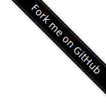
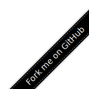

"Fork me on GitHub" SVG Ribbon Generator
========================================

[](https://github.com/CyberZHG/fork-me-on-github-svg-ribbon/actions/workflows/build-and-deploy.yml)

## Introduction

https://cyberzhg.github.io/fork-me-on-github-svg-ribbon/

An online tool that generates "Fork me on GitHub" ribbons. You can set the ribbon’s text, size, color, and other properties.

The default ribbons are:

|     |     |
|:------------------------------------------:|:-------------------------------------------:|
|  |  |

## Example Usage

Add this to HTML:

```html
<a href="https://github.com/<Your-Name>/<Your-Repo>" class="github-ribbon">
  " alt="Fork me on GitHub">
</a>
```

And add this to CSS:

```css
@media (max-width: 768px) {
    .github-ribbon {
        display: none;
    }
}

.github-ribbon {
    position: fixed;
    top: 0;
    right: 0;
    z-index: 9999;
}
```

Then this GitHub ribbon will always appear in the top-right corner of the webpage and will be hidden when the page width is less than 768px.
